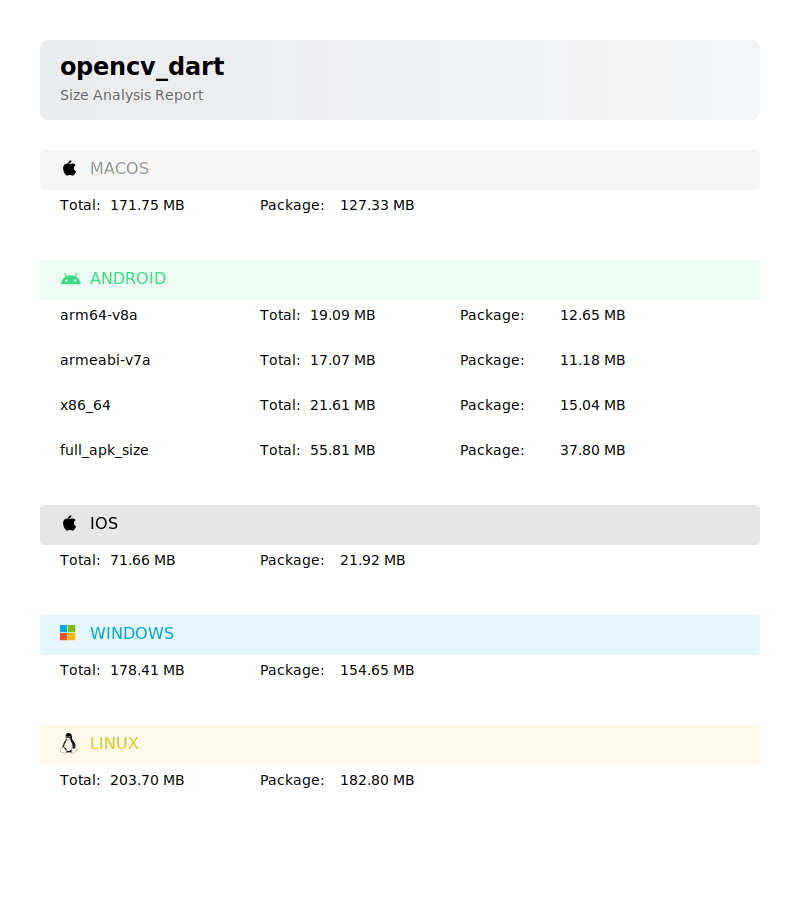

# opencv_dart

OpenCV for Flutter, includes all modules. if `videoio` and `highgui` are not reqired,
use [opencv_core](https://pub.dev/packages/opencv_core)

> [!IMPORTANT]
>
> From `v1.3.0`, dynamic libraries will be built locally, invoked by flutter during the build.
> Note: OpenCV SDK (~100M) will be downloaded via `FetchContent` of cmake, you can
> set `DARTCV_CACHE_DIR` environment variable to cache it and avoid downloading it again.
> e.g., `export DARTCV_CACHE_DIR=$HOME/.cache/dartcv`
>
> - Q&A: [#212](https://github.com/rainyl/opencv_dart/issues/212) or open new issues.
> - ~~If you are using flutter with [Native Assets](https://github.com/flutter/flutter/issues/129757) feature supported, consider using v2.x version, see more in [native-assets branch](https://github.com/rainyl/opencv_dart/tree/native-assets)~~ Won't update until `Native Assets` being stable.

## Supported platforms

| Platform | Supported          | Tested             | Platforms                      |
| -------- | ------------------ | ------------------ | ------------------------------ |
| Android  | :white_check_mark: | :white_check_mark: | x86_64, arm64-v8a, armeabi-v7a |
| iOS      | :white_check_mark: | :white_check_mark: | arm64, x64(Simulator)          |
| Linux    | :white_check_mark: | :white_check_mark: | x64, arm64                     |
| Windows  | :white_check_mark: | :white_check_mark: | x64, arm64                     |
| macOS    | :white_check_mark: | :white_check_mark: | x64, arm64                     |

## Supported modules

[Supported modules](https://github.com/rainyl/opencv_dart?tab=readme-ov-file#status)

## Package Size



## Examples

see [example](https://github.com/rainyl/opencv_dart/tree/main/packages/opencv_dart/example)

More examples refer to [awesome-opencv_dart](https://github.com/rainyl/awesome-opencv_dart) and share yours

## Screenshots

see [Demos](https://github.com/rainyl/opencv_dart?tab=readme-ov-file#Demos)

## License

[Apache-2.0 License](LICENSE)

## Customizing OpenCV Modules

You can enable or disable specific OpenCV modules for your build by providing a configuration file named `opencv_config.cmake` in your app's root directory (the top-level directory of your project, where you run your build commands).

### Steps

1. **Create `opencv_config.cmake`**

   Create a file named `opencv_config.cmake` in your app's root directory.

2. **Edit the File**

   Set each module ON or OFF as desired:

   ```cmake
   set(DARTCV_WITH_CALIB3D ON CACHE BOOL "Enable OpenCV calib3d module" FORCE)
   set(DARTCV_WITH_CONTRIB ON CACHE BOOL "Enable OpenCV contrib module" FORCE)
   set(DARTCV_WITH_DNN ON CACHE BOOL "Enable OpenCV dnn module" FORCE)
   set(DARTCV_WITH_FEATURE2D ON CACHE BOOL "Enable OpenCV feature2d module" FORCE)
   set(DARTCV_WITH_HIGHGUI OFF CACHE BOOL "Enable OpenCV highgui module" FORCE)
   set(DARTCV_WITH_IMGPROC ON CACHE BOOL "Enable OpenCV imgproc module" FORCE)
   set(DARTCV_WITH_OBJDETECT ON CACHE BOOL "Enable OpenCV objdetect module" FORCE)
   set(DARTCV_WITH_PHOTO ON CACHE BOOL "Enable OpenCV photo module" FORCE)
   set(DARTCV_WITH_STITCHING ON CACHE BOOL "Enable OpenCV stitching module" FORCE)
   set(DARTCV_WITH_VIDEO ON CACHE BOOL "Enable OpenCV video module" FORCE)
   set(DARTCV_WITH_VIDEOIO ON CACHE BOOL "Enable OpenCV videoio module" FORCE)
   set(DARTCV_WITH_GAPI OFF CACHE BOOL "Enable OpenCV gapi module" FORCE)
   set(DARTCV_WORLD OFF CACHE BOOL "Enable OpenCV world module" FORCE)
   ```

   - `ON` enables the module, `OFF` disables it.
   - Only modules set to `ON` will be included in your build.

3. **Build Your Package**

   When you build your package, the build system will automatically detect and use your `opencv_config.cmake` file from your app root. If the file is not present, default module settings will be used.

#### Example: Enable only `imgproc` and `core` modules

```cmake
set(DARTCV_WITH_IMGPROC ON CACHE BOOL "Enable OpenCV imgproc module" FORCE)
set(DARTCV_WITH_CALIB3D OFF CACHE BOOL "Enable OpenCV calib3d module" FORCE)
set(DARTCV_WITH_CONTRIB OFF CACHE BOOL "Enable OpenCV contrib module" FORCE)
set(DARTCV_WITH_DNN OFF CACHE BOOL "Enable OpenCV dnn module" FORCE)
set(DARTCV_WITH_FEATURE2D OFF CACHE BOOL "Enable OpenCV feature2d module" FORCE)
set(DARTCV_WITH_HIGHGUI OFF CACHE BOOL "Enable OpenCV highgui module" FORCE)
set(DARTCV_WITH_OBJDETECT OFF CACHE BOOL "Enable OpenCV objdetect module" FORCE)
set(DARTCV_WITH_PHOTO OFF CACHE BOOL "Enable OpenCV photo module" FORCE)
set(DARTCV_WITH_STITCHING OFF CACHE BOOL "Enable OpenCV stitching module" FORCE)
set(DARTCV_WITH_VIDEO OFF CACHE BOOL "Enable OpenCV video module" FORCE)
set(DARTCV_WITH_VIDEOIO OFF CACHE BOOL "Enable OpenCV videoio module" FORCE)
set(DARTCV_WITH_GAPI OFF CACHE BOOL "Enable OpenCV gapi module" FORCE)
set(DARTCV_WORLD OFF CACHE BOOL "Enable OpenCV world module" FORCE)
```

- You can version-control your `opencv_config.cmake` or add it to `.gitignore` for per-user customization.
- To revert to default settings, simply delete or rename your `opencv_config.cmake` file.
- This approach works for both `opencv_dart` and `opencv_core` packages.
